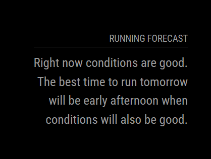

# MMM-RunningForecast

The `MMM-RunningForecast` is a MagicMirror² module that displays running forecasts from weather.com.



## Installation

1. Navigate to your MagicMirror modules directory:
    ```sh
    cd ~/MagicMirror/modules
    ```

2. Clone the repository:
    ```sh
    git clone https://github.com/yourusername/MMM-RunningForecast.git
    ```

3. Navigate to the module's directory:
    ```sh
    cd MMM-RunningForecast
    ```

4. Install the dependencies:
    ```sh
    npm install
    ```

## Configuration

To use this module, add it to the `config.js` file in your MagicMirror configuration directory. Here is an example configuration:

```javascript
{
    module: "MMM-RunningForecast",
    position: "top_right",
    config: {
        updateInterval: 3600000, // Update interval in milliseconds
        url: "https://weather.com/activity-hub/running/ff7365bc39d17586e7712568d30f5fc13663ab9db4b676b3f2eb80eeb3cad4c1"
    }
}
```

### Configuration Options

| Option          | Description                                         | Default Value |
|-----------------|-----------------------------------------------------|---------------|
| `updateInterval`| The interval at which the module updates, in milliseconds. | 3600000       |
| `url`           | The URL to fetch the running forecast data from.    | ""            |

For the `url`, go to the "Activities Hub" in [weather.com](https://weather.com/activity-hub/running/ff7365bc39d17586e7712568d30f5fc13663ab9db4b676b3f2eb80eeb3cad4c1), type the desired location in the text bar. The web page should have a "Running Forecast" section. Copy the URL to the configuration setting.

### License

This project is licensed under the MIT License - see the [LICENSE](https://github.com/supermem613/MMM-RunningForecast/blob/main/LICENSE) file for details.
